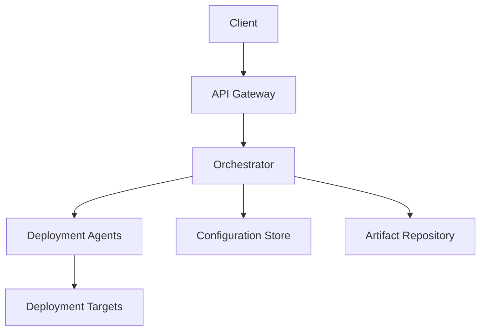

# System Overview

## Introduction
<!-- Brief introduction to the deployment system and its purpose -->

## System Architecture
<!-- High-level architecture diagram and explanation -->

## Components
<!-- List and description of main components -->

### API Gateway
<!-- Description of the API Gateway component -->

### Orchestrator
<!-- Description of the Orchestrator component -->

### Deployment Agents
<!-- Description of the Deployment Agents -->

### Configuration Store
<!-- Description of the Configuration Store -->

### Artifact Repository
<!-- Description of the Artifact Repository -->

## Communication Flow
<!-- Description of how components communicate -->

## Infrastructure Requirements
<!-- Overview of infrastructure requirements --> 