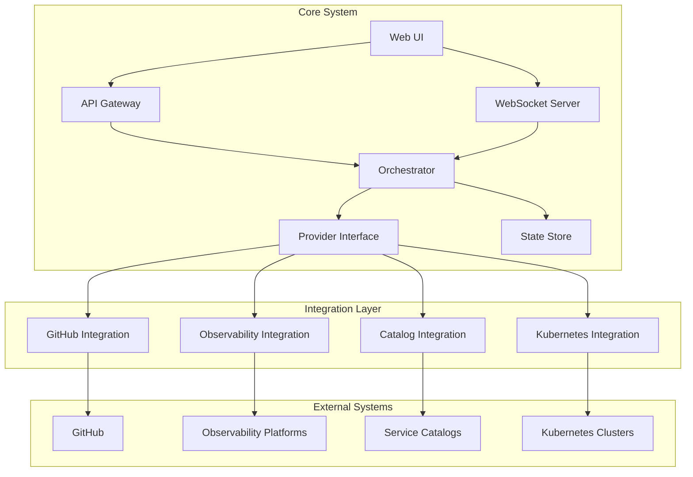

# System Overview

## Introduction
The deployment system provides a cloud-native platform for managing software deployments at scale. It integrates with existing tools and platforms while providing a consistent, golden-path approach to deployment management.

## System Architecture

## Components

### Core Components

#### API Gateway
- RESTful API endpoints for system interaction
- Authentication and authorization
- Rate limiting and request validation
- API versioning and documentation

#### Web UI
- React-based frontend (as per ADR-0005)
- Real-time updates via WebSocket
- Responsive design
- Role-based access control

#### Orchestrator
- Deployment workflow management
- State coordination
- Event processing
- Provider coordination

#### State Store
- Deployment state management
- Configuration storage
- Audit logging
- Event history

#### Provider Interface
- Standard integration patterns
- Provider lifecycle management
- Feature detection
- Error handling

### Integration Components

#### GitHub Integration
- Repository management
- Webhook processing
- CI/CD integration
- Merge queue support
- Monorepo/polyrepo support

#### Observability Integration
- Metric collection
- Alert management
- Performance monitoring
- Custom SLO/SLI tracking

#### Service Catalog Integration
- Service metadata sync
- Dependency management
- Configuration management
- Service discovery

#### Kubernetes Integration
- Multi-cluster management
- Deployment strategies
- Resource management
- Health monitoring

## Communication Flow
1. **Client Interactions**
   - RESTful API calls for operations
   - WebSocket for real-time updates
   - Event-driven architecture

2. **Integration Communication**
   - Provider-specific protocols
   - Standardized error handling
   - Rate limiting and backoff
   - Circuit breaking

3. **State Management**
   - Event sourcing
   - Eventual consistency
   - State reconciliation
   - Conflict resolution

## Infrastructure Requirements

### Compute Resources
- Kubernetes cluster for core services
- Scalable web tier
- Background workers
- WebSocket servers

### Storage
- Persistent state store
- Event log storage
- Configuration storage
- Metrics storage

### Networking
- Load balancing
- Service mesh (optional)
- Cross-cluster communication
- Provider API access

### Security
- TLS everywhere
- Authentication
- Authorization
- Secrets management
- Audit logging 