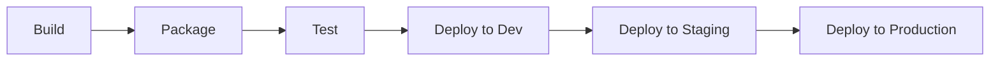

# Deployment Workflow

## Overview
<!-- Overview of the deployment workflow process -->

## Workflow Stages

### Build
<!-- Description of the build stage -->

### Package
<!-- Description of the packaging stage -->

### Test
<!-- Description of the testing stage -->

### Deployment Process
<!-- Details about the deployment process across environments -->

## Deployment Strategies

### Blue/Green Deployment
<!-- Description of blue/green deployment strategy -->

### Canary Releases
<!-- Description of canary release strategy -->

### Progressive Delivery
<!-- Description of progressive delivery approach -->

## Rollback Mechanism
<!-- Description of rollback process and considerations -->

## Environment Promotion
<!-- How artifacts are promoted between environments -->

## Approval Gates
<!-- Description of approval requirements between stages --> 