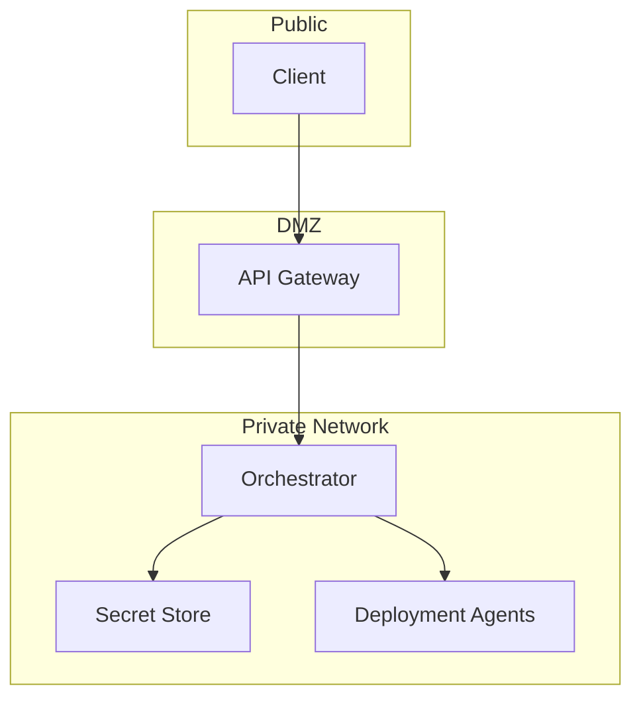

# Security Model

## Overview
<!-- Overview of the security model and principles -->

## Authentication and Authorization
<!-- Description of authentication and authorization mechanisms -->

### User Authentication
<!-- How users authenticate to the system -->

### Service Authentication
<!-- How services authenticate to each other -->

### Role-Based Access Control
<!-- Description of RBAC model -->

## Secrets Management
<!-- How secrets are managed and distributed -->

## Network Security
<!-- Network security considerations and architecture -->

## Secure Configuration
<!-- How configuration is securely managed -->

## Vulnerability Management
<!-- Approach to vulnerability management -->

## Audit and Compliance
<!-- Audit logging and compliance considerations -->

## Security Testing
<!-- Security testing approach and practices -->

## Incident Response
<!-- Security incident response process --> 